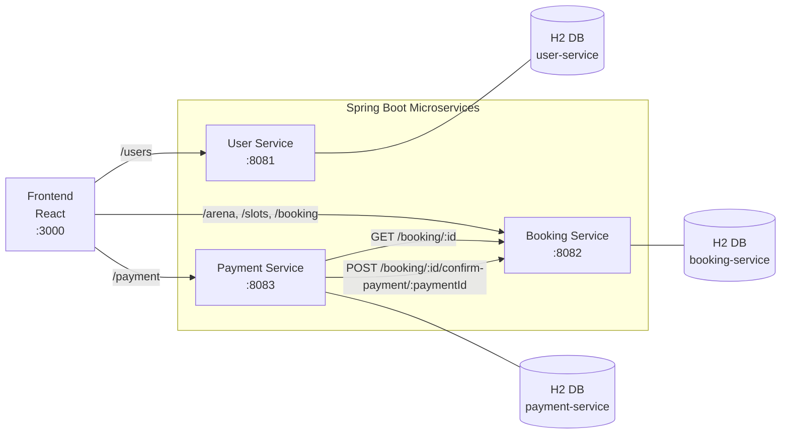

# PlayArena (Microservices)

A slot booking app split into three Spring Boot microservices and one React frontend.

## Architecture



## Services and Ports

- Frontend: `http://localhost:3000`
- User Service: `http://localhost:8081`
- Booking Service: `http://localhost:8082`
- Payment Service: `http://localhost:8083`

## Quick Start

1. Start User Service

```bash
cd user-service
mvn spring-boot:run
```

2. Start Booking Service

```bash
cd booking-service
mvn spring-boot:run
```

3. Start Payment Service

```bash
cd payment-service
mvn spring-boot:run
```

4. Start Frontend

```bash
cd frontend
npm install
npm start
```

## H2 Console URLs

- User Service H2: `http://localhost:8081/h2-console/`
- Booking Service H2: `http://localhost:8082/h2-console/`
- Payment Service H2: `http://localhost:8083/h2-console/`

Use:

- JDBC URL: `jdbc:h2:mem:testdb`
- Username: `sa`
- Password: *(empty)*

## Notes

- Frontend refresh does not delete backend data.
- Data is in-memory H2, so it is cleared when a service restarts.
