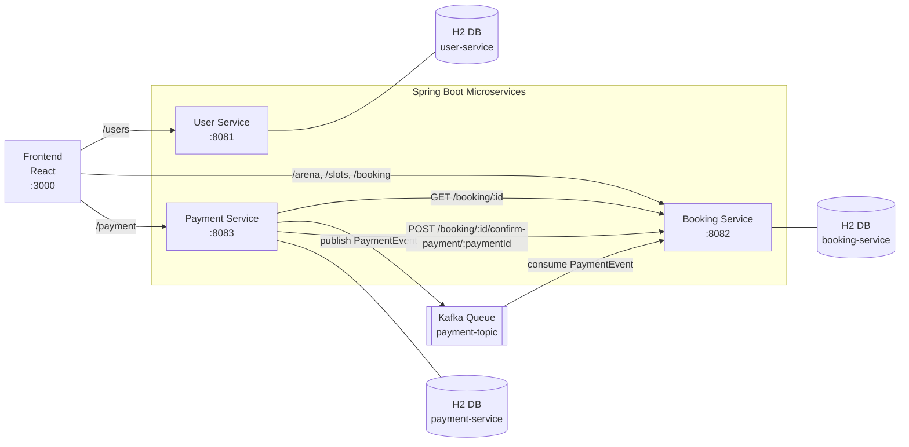

# PlayArena (Microservices)

A slot booking app split into three Spring Boot microservices and one React frontend.

## Architecture



## Kafka Integration (Simplified)

The payment flow uses Kafka first, with REST fallback for safety.

1. `payment-service` creates payment and publishes `PaymentEvent` to topic `payment-topic`.
2. `booking-service` listens to `payment-topic` and updates booking + slot status.
3. If Kafka publish fails, `payment-service` calls:
   `POST /booking/{bookingId}/confirm-payment/{paymentId}`
   so booking update still succeeds.

<!-- Kafka-related files:

- `docker-compose.yml` : local Kafka + Zookeeper containers
- `payment-service/src/main/resources/application.properties` : Kafka producer config
- `payment-service/src/main/java/com/anshu/payment_service/PaymentService.java` : publish + fallback logic
- `booking-service/src/main/resources/application.properties` : Kafka consumer config
- `booking-service/src/main/java/com/anshu/PlayArena/payment/PaymentEventListener.java` : event consumer logic
- `booking-service/src/main/java/com/anshu/PlayArena/payment/PaymentEvent.java` : consumer payload type
- `payment-service/src/main/java/com/anshu/payment_service/PaymentEvent.java` : producer payload type -->

## Services and Ports

- Frontend: `http://localhost:3000`
- User Service: `http://localhost:8081`
- Booking Service: `http://localhost:8082`
- Payment Service: `http://localhost:8083`

## Quick Start

### Option A: Run with VS Code tasks

Run task `Run All` from VS Code. It starts:

- Kafka (`docker compose up -d`)
- User Service
- Booking Service
- Payment Service
- Frontend

### Option B: Run manually

1. Start Kafka

```bash
docker compose up -d
docker compose ps
```

2. Start User Service

```bash
cd user-service
mvn spring-boot:run
```

3. Start Booking Service

```bash
cd booking-service
mvn spring-boot:run
```

4. Start Payment Service

```bash
cd payment-service
mvn spring-boot:run
```

5. Start Frontend

```bash
cd frontend
npm install
npm start
```

## Verify Kafka Is Running

```bash
docker compose ps
```

You should see:

- `playarena-kafka` status `Up`
- `playarena-zookeeper` status `Up`


## Inspect Kafka Messages And Consumer Progress

Use these commands from project root to view posted events and whether booking-service consumed them.

1. List topics

```bash
docker.exe exec -it playarena-kafka kafka-topics --bootstrap-server localhost:9092 --list
```

2. View events in `payment-topic` (from beginning)

```bash
docker.exe exec -it playarena-kafka kafka-console-consumer --bootstrap-server localhost:9092 --topic payment-topic --from-beginning --property print.timestamp=true --property print.value=true --property print.headers=true
```

3. Check booking-service consumer group lag

```bash
docker.exe exec -it playarena-kafka kafka-consumer-groups --bootstrap-server localhost:9092 --group booking-service-group --describe
```

How to read lag output:

- `CURRENT-OFFSET` close to `LOG-END-OFFSET` means consumer is caught up.
- `LAG = 0` means all posted events are consumed.

## Kafka Troubleshooting

1. If `docker compose up -d` fails with image errors, run:

```bash
docker compose pull
docker compose up -d
```

2. If booking is not updating after payment:

- Check `booking-service` logs for `Received payment event`.
- Create a fresh booking and then pay that booking id.
- Remember H2 is in-memory; restarting services resets data.

## H2 Console URLs

- User Service H2: `http://localhost:8081/h2-console/`
- Booking Service H2: `http://localhost:8082/h2-console/`
- Payment Service H2: `http://localhost:8083/h2-console/`

Use:

- JDBC URL: `jdbc:h2:mem:testdb`
- Username: `sa`
- Password: *(empty)*

## Notes

- Frontend refresh does not delete backend data.
- Data is in-memory H2, so it is cleared when a service restarts.
- Kafka is used for async payment events.